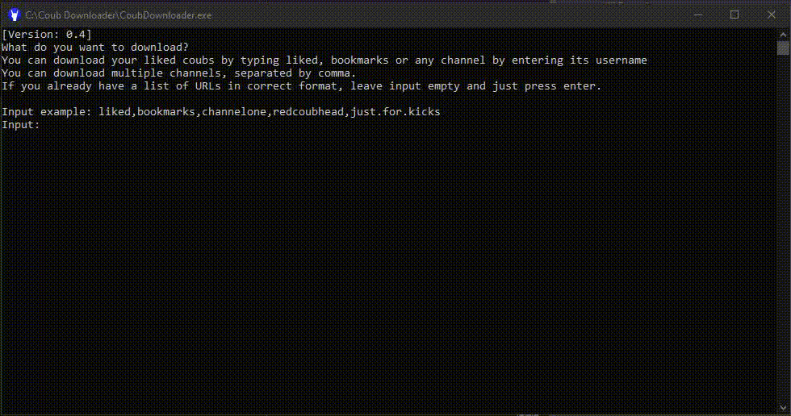
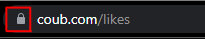
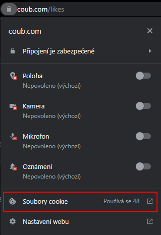
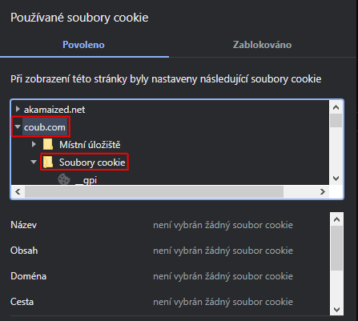
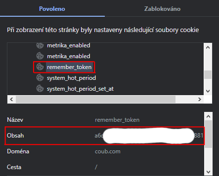
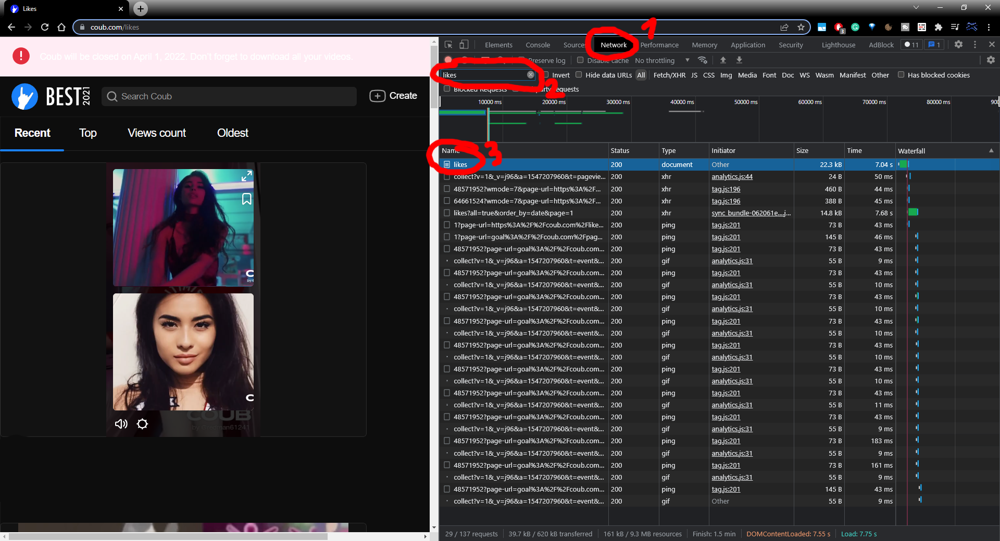
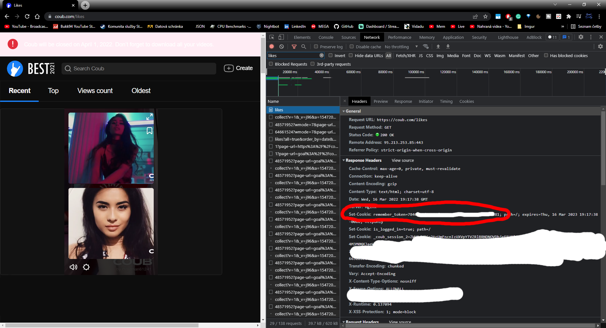

# Coub Downloader

This downloader is console application targeted for Windows users and 
all fans of [Coub](http://www.coub.com).
For now, this downloader is able to download: 
* **LIKED** coubs from user's profile (keyword `liked`)
* **Bookmarked** coubs (keyword `bookmarks`)
* **Coubs** from any channel
* Channel's **reposts**
* **Own list** of Coub URLs

### Table of contents

* [How it works](#how-it-works)
    + [Downloading own list of URLs](#downloading-own-list-of-urls)
* [Requirements](#requirements)
* [How to install ffmpeg](#how-to-install-ffmpeg)
* [How to run](#how-to-run)
    + [Username vs Display name](#username-vs-display-name)
* [Configuration](#configuration)
    + [Configuration Properties](#configuration-properties)
* [Files structure](#files-structure)
* [Understanding metadata](#understanding-metadata)
    + [Basic raw metadata](#basic-raw-metadata)
    + [Segments](#segments)
* [How to find Access Token](#how-to-find-access-token)
* [Credit](#credit)
* [Troubleshooting](#troubleshooting)

## How it works

User will input names of what to download. Then the tool it will gather 
all the links with Coubs metadata. In the second phase
it will download all gathered coubs one by one. Each coub will be processed
in highest available quality in mp4 format.

If user is downloading liked/bookmarked coubs, he must provide personal Access Token.

Tool will automatically skip URL gathering if URL list already exists and 
skips all already downloaded coubs (if name matches).

### Downloading own list of URLs
You can also choose to download your own list by inserting it
into proper structure. Create a folder called `Coubs-info` 
inside the folder where `CoubDownloader.exe` is. Inside that, create another
folder, call it whatever you want (e.g. `MyList`). And inside that subfolder, 
create file `url_list.txt` with URLs to download. 
**URLs must be separated by new-lines.**

Final structure should look like this: `CoubDownloader\Coubs-info\mylist\url_list.txt`.
When running the downloader, 
during input insert nothing (just hit enter to continue) or insert name 
of the folder (in this case `MyList`).

## Requirements
No installation or additional download needed if you'll download `full` 
version of the Downloader in the [Releases](https://github.com/Bukk94/CoubDownloader/releases) section.

Otherwise it depends on:
* ffmpeg
* Python 3.6 and above (included in all release packages)

## How to install ffmpeg

* Download newest version of [ffmpeg here](https://www.gyan.dev/ffmpeg/builds/ffmpeg-git-full.7z)
* Unzip downloaded file, for example to `C:\ffmpeg`
  * Go to `\bin` folder and find `ffmpeg.exe`
  * Copy this executable file into root folder of the downloader (at the same level as CoubDownloader.exe)
* **OR**
  * Open CMD with admin privileges and type following command:
  * `setx /m PATH "C:\ffmpeg\bin;%PATH%"`
  * Restart PC (yes, this is mandatory)

If you save ffmpeg into different folder than `C:\ffmpeg`, don't forget to 
modify the command in CMD accordingly to match actual `\bin` directory.

## How to run
* Download [latest release package](https://github.com/Bukk94/CoubDownloader/releases) (already contain portable Python)
* Make sure you have ffmpeg installed
* Run `CoubDownloader.exe`
* Enter channels usernames (not display names!) to download, keywords `liked` or `bookmarks` to download liked/bookmarked coubs.
  * You can download multiple channels at once, separated by comma (e.g. `liked,bookmarks,coub.channel`)

### Username vs Display name
If you want to download specific channel, you must enter channel's username.
This can be confusing as username is not same thing as Display name. 
My display name is `Bukk94`, but my username is `bukk9433113`.

Username is often auto-generated (unless specified otherwise) with 
8 or more characters, numbers, dots or dashes. Username can be
found as part of the channel's URL address (e.g. `https://coub.com/bukk9433113`).

## Configuration
CoubDownload is meant to be as simple as possible. Although you can set
some settings through downloader itself, it wasn't enough for more advanced users.
For those users, there is `Configuration.json` file in the root directory.
Using this file you can further modify final
output of the downloader.

You can open the file with any text editor (for example `notepad`).

### Configuration properties
* `DownloadSegments` - true/false if CoubDownloader should download additional metadata.
* `Loops` - Number of loops for final video (by default until end of audio, but someone wants just one loop).
* `WaitTime` - Number of seconds to wait between each download. This reduces Coub's server load and you can more easily avoid ban detection.
* `VideoQuality` - By default, highest quality is downloaded, but you can download Medium (~720p) or Low (~360p) quality.
* `KeepAudioVideo` - Each Coub consists of audio and video. They are both combined into final Coub. By default those files are removed, but you can choose to keep them.
* `OutputFolderPath` - By default, all Coubs are downloaded into Root directory. You can change that and enter your own directory (e.g. on a different drive).
* `NsfwOnly` - true/false if CoubDownloader should download only NSFW coubs or all of them. NOTE that Coub will permanently remove all NSFW coubs on **June 27th 2022**, and this option will stop working (as there will be nothing to download).

## Files structure
* [Root]\Coubs-info\\[dir]
  * Contains URLs to download as well as some metadata information like coub's
    original name and tags. Each category has its own folder
* [Root]\Coubs\\[dir]
  * Actual coubs downloaded by the tool
* [Root]\Coubs\\[dir]\\Reposts
    * Channel reposted coubs

## Understanding metadata
### Basic raw metadata
Metadata are JSON files containing detail information about each coub.
Within those metadata you can find information like Coub's category,
views/likes/dislikes count, tags, size, audio/video URLs with different qualities,
if coub is NSFW, banned, age restricted, cropped, and many many more.

### Segments
Special metadata type are segments. They
contain similar information like metadata. But in addition to that
they contain raw video (without COUB watermark) as well as exact audio
marks. 

Not every coub has segments data (mostly recoubs) and sometimes the 
segments might not be even generated. Segments generation can be tracked
by linked state/progress. I assume that generation is triggered by 
hitting correct API endpoint on /segments.

## How to find Access Token
There are several ways to obtaining your Access Token.

**Option 1:**
1. Log into your Coub account
2. Go to your [likes page](https://coub.com/likes)
3. Next the URL address, you'll find a small lock icon

   

4. After clicking on the lock, a small window appears. Select `Cookies`:

   

5. New window will pop out. Select `coub.com` and then `Cookies` folder:

   

6. In this list, find item called `remember_token`

   

7. Click on this value and it should display details
8. You should see long set of numbers and letters, this is your Access Token, 
 copy it to the tool when asked. 

**Option 2:**

1. Log into your Coub account
2. Go to your [likes page](https://coub.com/likes)
3. Open developer console (press F12 if using Google Chrome)
4. Go to Network tab (number 1 in picture)
5. Reload the page (refresh / press F5)
6. You should see a lot of stuff going on in the Network tab. Wait for page to fully load
7. To ease the search, type 'likes' into the search bar (number 2 in picture)
8. Click on the row called 'likes' (number 3 in picture)
9. In 'Response Headers', search for value `remember_token=`
10. The value after `=` is your Access Token, 
copy it to the tool when asked.

## Credit

Python script was originally written by [artemtar](https://github.com/artemtar/CoubDownloader).
I used his script as a base and made several adjustments to properly fit
this CoubDownloader's usage and to avoid common issues and problems.

## Troubleshooting
* **Problem**: Program closes right after opening
  + **Solution**: This is caused by missing [.NET 5.0 runtime library](https://dotnet.microsoft.com/en-us/download/dotnet/5.0/runtime). 
 Try installing the runtime library or downloading full version of the tool.
* **Problem**: CoubDownloader cannot download coubs/lists and I can't access Coub websites anymore.
  + **Solution**: That means you were temporarily IP banned from Coub's website (usually for 1 hour).
  Don't panic, after some time you'll be able to access it again. 
  This happens when you are mass downloading coubs within short interval.
  Try opening `Configuration.json` file and increasing `WaitTime` to 3 or more seconds. 